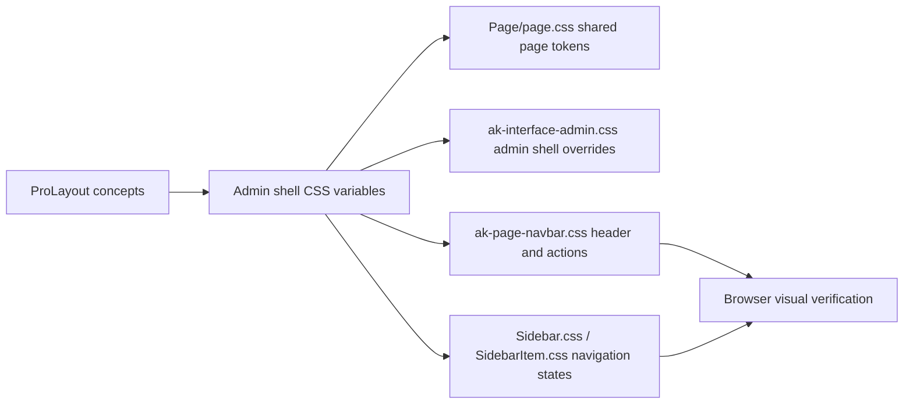

# refactor: ProLayout-inspired admin shell styling

## Overview

Adjust the admin interface shell so the sidebar and header follow the interaction and visual language of Ant Design ProComponents ProLayout, while staying inside the project's existing Lit + PatternFly architecture. The work should be a scoped styling/refinement pass, not a framework migration.

## Problem Frame

The requested target is the ProComponents Layout API page, especially its sidebar style, header interaction colors, and layout options such as side navigation, fixed header/sidebar, menu width, and header/sidebar tokens. This repository already has a working admin shell built with `ak-interface-admin`, `ak-page-navbar`, and `ak-sidebar`; replacing it with Ant React components would introduce a second UI stack and unnecessary risk. The better plan is to translate the relevant ProLayout concepts into the existing PatternFly CSS variable system.

## Requirements Trace

- R1. The admin sidebar should look and behave closer to ProLayout side navigation: clearer active item, calmer hover state, consistent nested menu spacing, and brand-aligned width.
- R2. The admin header should use ProLayout-like interaction colors: subtle background, visible action hover/focus states, compact tool affordances, and stable contrast in light/dark themes.
- R3. The implementation must keep the existing Lit + PatternFly shell and avoid adding `@ant-design/pro-components` or React layout dependencies.
- R4. Responsive behavior must remain intact: desktop sidebar defaults open, mobile/tablet sidebar behaves as an overlay with backdrop.
- R5. The change should be easy to tune after visual review, using local CSS custom properties rather than scattered hard-coded colors.

## Scope Boundaries

- No framework migration to Ant Design or React ProLayout.
- No new navigation data model, route structure, permissions model, or menu filtering logic.
- No split menu implementation unless requested separately later.
- No changes to user interface pages under `web/src/user/`.
- No changes to flow/login layout behavior.
- No project documentation beyond this implementation plan.

## Context & Research

### Relevant Code and Patterns

- `web/src/admin/ak-interface-admin.ts` owns the admin shell composition, sidebar open state, desktop media query, mobile backdrop, notification drawer, and router outlet.
- `web/src/admin/ak-interface-admin.css` contains admin-shell-specific layout overrides and is the right place for admin-only shell rules.
- `web/src/components/ak-page-navbar.ts` renders the brand area, sidebar toggle slot, page title/description, command palette trigger, version banners, enterprise status, and right-side nav buttons.
- `web/src/components/ak-page-navbar.css` controls header layout, brand block width, header height, title/description grid, and responsive behavior.
- `web/src/elements/sidebar/Sidebar.ts` and `web/src/elements/sidebar/SidebarItem.ts` render PatternFly nav markup; keep this markup unless a styling goal cannot be reached through CSS.
- `web/src/elements/sidebar/Sidebar.css` and `web/src/elements/sidebar/SidebarItem.css` already theme PatternFly nav variables for light/dark modes.
- `web/src/styles/authentik/components/Page/page.css` defines global PatternFly page/sidebar/header variables used by the admin shell.
- `web/src/styles/authentik/base/variables.css` defines shared authentik variables such as `--ak-accent`.
- `web/src/components/stories/ak-page-navbar.stories.ts` exists and can be expanded for header state coverage.

### Institutional Learnings

- No relevant `docs/solutions/` entries or `critical-patterns.md` file were present in this checkout.

### External References

- ProComponents Layout API: `https://procomponents.ant.design/components/layout?tab=api`
- Relevant concepts from the API page: `layout`, `navTheme`, `headerTheme`, `siderWidth`, `fixedHeader`, `fixSiderbar`, `menuRender`, `menuItemRender`, and layout/header/sider tokens.

## Key Technical Decisions

- Keep PatternFly markup and Lit components: the project already wraps PatternFly nav/page primitives, and the requested behavior can be achieved with CSS variables and small shell refinements.
- Add an admin shell token layer before tuning individual selectors: mapping ProLayout-like concepts to local variables makes later color/spacing adjustment simple and avoids duplicated literals.
- Prefer CSS-only changes unless markup blocks a necessary interaction state: this keeps the change low-risk and avoids altering route, drawer, or command-palette behavior.
- Treat Ant ProLayout as a reference, not a dependency: the implementation should feel similar without importing Ant runtime assumptions into this repo.
- Verify both light and dark themes: existing code has explicit dark-theme overrides, and sidebar/header contrast is easy to regress.

## Open Questions

### Resolved During Planning

- Should Ant ProComponents be installed? No. The repository is Lit + PatternFly, and the request can be satisfied by adapting the existing admin shell.
- Should the plan target user pages too? No. The request is about project theme layout, sidebar, and header; the relevant shared shell is the admin interface.

### Deferred to Implementation

- Exact color values: choose first-pass values from existing tokens, then tune after browser screenshots.
- Whether `ak-page-navbar` should be visually compacted from its current tall title/description layout: decide during implementation after checking pages with and without descriptions.
- Whether Storybook coverage is enough or an e2e smoke test is worthwhile: decide based on how much markup changes. CSS-only work can rely on Storybook/browser verification.

## High-Level Technical Design

> This illustrates the intended approach and is directional guidance for review, not implementation specification. The implementing agent should treat it as context, not code to reproduce.

## Implementation Units

- [x] **Unit 1: Define admin shell visual tokens**

**Goal:** Introduce a small set of ProLayout-inspired local CSS variables for header height/background/hover state, sidebar width/background, active item color, and item radius/spacing.

**Requirements:** R1, R2, R5

**Dependencies:** None

**Files:**
- Modify: `web/src/admin/ak-interface-admin.css`
- Modify: `web/src/styles/authentik/components/Page/page.css`
- Test: `web/src/components/stories/ak-page-navbar.stories.ts`

**Approach:**
- Keep shared PatternFly variables in `Page/page.css` when they affect page/sidebar/header primitives globally.
- Put admin-only variables in `ak-interface-admin.css` so user and flow interfaces are not pulled into this visual change.
- Use existing palette variables and `--ak-accent` before introducing new color literals.
- Keep light and dark theme values explicit where current code already separates them.

**Patterns to follow:**
- Existing PatternFly variable overrides in `web/src/styles/authentik/components/Page/page.css`.
- Existing theme-specific sidebar rules in `web/src/elements/sidebar/Sidebar.css`.

**Test scenarios:**
- Visual token smoke: open an admin page in light theme and confirm the header, brand block, and sidebar resolve to the new token values without blank or transparent unintended areas.
- Visual token smoke: switch to dark theme and confirm contrast remains readable for page title, sidebar labels, and nav action icons.
- Regression: confirm user interface pages are unaffected because the admin-only token layer is scoped to `ak-interface-admin`.

**Verification:**
- CSS variables are centralized and named by shell concept rather than by one-off selector.
- Light/dark theme screenshots show no contrast loss in header or sidebar.

- [x] **Unit 2: Refine sidebar menu styling**

**Goal:** Make the admin sidebar resemble ProLayout side navigation while preserving existing `ak-sidebar` and `ak-sidebar-item` behavior.

**Requirements:** R1, R3, R4, R5

**Dependencies:** Unit 1

**Files:**
- Modify: `web/src/elements/sidebar/Sidebar.css`
- Modify: `web/src/elements/sidebar/SidebarItem.css`
- Create: `web/src/elements/sidebar/Sidebar.stories.ts`
- Test: `web/src/elements/sidebar/Sidebar.stories.ts`

**Approach:**
- Tune width, padding, nested item spacing, hover background, current item background, current indicator, and expandable toggle alignment through PatternFly nav variables and existing parts.
- Preserve `aria-current`, `aria-expanded`, and nested slot rendering in `SidebarItem.ts`.
- Avoid changing `renderSidebarItems` unless styling reveals a missing semantic hook.
- Keep the current mobile hidden/expanded behavior owned by `ak-interface-admin.ts`.

**Patterns to follow:**
- `web/src/elements/sidebar/Sidebar.css` light-theme inversion pattern.
- `web/src/elements/sidebar/SidebarItem.css` current-item border and `part` usage.

**Test scenarios:**
- Happy path: navigate between two admin routes and confirm the matching sidebar item uses the active background/text treatment.
- Happy path: expand a parent menu and confirm child items inherit spacing and hover styles without layout shift.
- Edge case: sidebar item with `enterprise` notice remains readable and aligned under the new item spacing.
- Responsive: below `1200px`, opening the sidebar still shows overlay/backdrop behavior and the menu remains scrollable.
- Dark theme: active and hover states remain visually distinct without relying only on color differences that become low contrast.

**Verification:**
- Sidebar remains keyboard and screen-reader compatible because markup and ARIA behavior are unchanged.
- Nested menus and current route highlighting still work.

- [x] **Unit 3: Refine header layout and action interaction colors**

**Goal:** Align the admin header with ProLayout-like header behavior: stable height, brand/sidebar alignment, subtle background, and clear hover/focus feedback for tools.

**Requirements:** R2, R3, R4, R5

**Dependencies:** Unit 1

**Files:**
- Modify: `web/src/components/ak-page-navbar.css`
- Modify: `web/src/components/ak-nav-button.css`
- Modify: `web/src/admin/ak-interface-admin.css`
- Test: `web/src/components/stories/ak-page-navbar.stories.ts`

**Approach:**
- Keep `ak-page-navbar.ts` structure unless CSS alone cannot express the intended interaction state.
- Align the brand block width with the sidebar width token.
- Tune header background, border, shadow, action button hit area, hover/focus/active colors, and command palette trigger spacing.
- Preserve existing page title and description rendering, but make spacing less visually heavy if it conflicts with ProLayout-like shell compactness.
- Ensure banner slots and right-side tools still fit on narrow viewports.

**Patterns to follow:**
- Existing grid layout in `web/src/components/ak-page-navbar.css`.
- Existing nav-button avatar theme overrides in `web/src/components/ak-nav-button.css`.

**Test scenarios:**
- Happy path: admin overview page with page title renders without title/action overlap at desktop width.
- Happy path: header actions show visible hover and focus states for command palette, user interface link, notifications, and API drawer controls.
- Edge case: a page with description clamps text cleanly without increasing the header beyond the intended responsive bounds.
- Responsive: at mobile width, brand hides, toggle appears, header controls do not overflow horizontally.
- Dark theme: header action hover/focus states remain visible against the dark header background.

**Verification:**
- Header feels visually connected to the sidebar but does not hide page content or break existing banners.
- Interactive controls preserve their existing click handlers and slots.

- [x] **Unit 4: Preserve admin shell behavior while tuning layout**

**Goal:** Ensure visual changes do not regress sidebar state, drawer layout, router outlet sizing, or notification/API drawers.

**Requirements:** R3, R4

**Dependencies:** Units 2 and 3

**Files:**
- Modify: `web/src/admin/ak-interface-admin.css`
- Modify: `web/src/admin/ak-interface-admin.ts` only if CSS hooks are insufficient
- Test: `web/src/components/stories/ak-page-navbar.stories.ts`

**Approach:**
- Keep `ak-interface-admin.ts` state and media-query logic unchanged if possible.
- Only add markup attributes/classes if a stable styling hook is missing.
- Verify the drawer panel still sits beside the router outlet and the sidebar backdrop still covers the content area on mobile.
- Do not alter `renderNotificationDrawerPanel`, command palette setup, or route access checks.

**Patterns to follow:**
- Current `sidebarOpen` media-query behavior in `web/src/admin/ak-interface-admin.ts`.
- Current `.pf-c-page__drawer` and `.pf-c-drawer` composition.

**Test scenarios:**
- Happy path: desktop viewport opens with sidebar expanded by default.
- Responsive: reducing viewport below `1200px` collapses the sidebar and shows the toggle control.
- Integration: opening notification/API drawer still expands the drawer panel without pushing the sidebar into an invalid layout.
- Regression: route changes keep the current sidebar auto-open/collapse behavior.

**Verification:**
- No behavioral diff in admin route access, drawer state, or router rendering.

- [x] **Unit 5: Add visual coverage and final browser verification**

**Goal:** Make the styling pass verifiable without requiring broad functional tests.

**Requirements:** R1, R2, R4, R5

**Dependencies:** Units 1-4

**Files:**
- Create: `web/src/elements/sidebar/Sidebar.stories.ts`
- Modify: `web/src/components/stories/ak-page-navbar.stories.ts`
- Test: `web/src/components/stories/ak-page-navbar.stories.ts`
- Test: `web/src/elements/sidebar/Sidebar.stories.ts`

**Approach:**
- Expand the navbar story to include representative header states: title only, title with description, icon, and narrow-ish action area if the story supports it simply.
- Add a focused sidebar story with a parent item, nested children, current item, enterprise notice, and enough entries to exercise scrolling.
- Use the real browser against the admin interface or Storybook for desktop and mobile screenshots.
- Prefer visual verification over adding brittle DOM assertions for CSS-only behavior.

**Patterns to follow:**
- Existing Storybook story structure in `web/src/components/stories/ak-page-navbar.stories.ts`.
- Existing frontend scripts in `web/package.json` for type/lint checks.

**Test scenarios:**
- Storybook: title-only navbar story renders with stable header height and no empty brand asset failure.
- Storybook: title + description story clamps description without overlapping secondary actions.
- Storybook: sidebar story shows hover, current, expanded, nested, enterprise, and scroll states without requiring a full admin session.
- Browser desktop: admin shell shows ProLayout-like sidebar/header treatment at `1440px` width.
- Browser mobile: admin shell toggle opens sidebar overlay and header actions remain reachable.
- Browser dark theme: sidebar/header states remain readable.

**Verification:**
- Screenshots confirm desktop and mobile layouts are not overlapping or visually broken.
- Type/lint checks pass for changed TypeScript and CSS imports if any TypeScript is touched.

## System-Wide Impact

- **Interaction graph:** Admin shell connects navbar, sidebar, router outlet, command palette, version banners, enterprise status, and notification/API drawers. Styling must not change event flow.
- **Error propagation:** Not applicable; this is a styling/layout refactor.
- **State lifecycle risks:** Sidebar open state, route-change synchronization, and drawer expanded/collapsed classes must remain unchanged unless implementation explicitly proves a safer hook is needed.
- **API surface parity:** No public API, backend route, or generated client change.
- **Integration coverage:** Browser verification should cover admin shell + sidebar + drawer together because isolated CSS review will not catch layout pressure.
- **Unchanged invariants:** Existing routes, permissions, localization messages, brand image selection, and page detail events remain unchanged.

## Risks & Dependencies

| Risk | Mitigation |
|------|------------|
| Header becomes too compact for pages with descriptions | Keep current description support and tune spacing after checking representative pages |
| Sidebar active state loses contrast in dark theme | Define light/dark token values explicitly and verify screenshots |
| PatternFly variable overrides accidentally affect user/flow interfaces | Scope admin-only changes to `ak-interface-admin` where possible |
| CSS-only changes are hard to test automatically | Expand Storybook states and use browser screenshot verification |
| Ant ProLayout concepts are over-applied | Keep only the concepts that map cleanly to existing shell behavior: side nav, header actions, fixed shell feel, width/color tokens |

## Documentation / Operational Notes

- No runtime migration or operational rollout is required.
- No user-facing copy changes are expected.
- If screenshots reveal significant design drift, tune CSS tokens rather than adding new layout abstractions.

## Sources & References

- Related code: `web/src/admin/ak-interface-admin.ts`
- Related code: `web/src/admin/ak-interface-admin.css`
- Related code: `web/src/components/ak-page-navbar.ts`
- Related code: `web/src/components/ak-page-navbar.css`
- Related code: `web/src/elements/sidebar/Sidebar.css`
- Related code: `web/src/elements/sidebar/SidebarItem.css`
- Related code: `web/src/styles/authentik/components/Page/page.css`
- External docs: `https://procomponents.ant.design/components/layout?tab=api`
